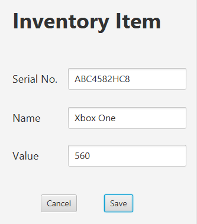
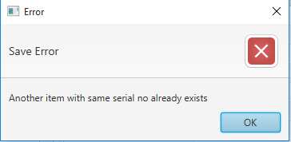
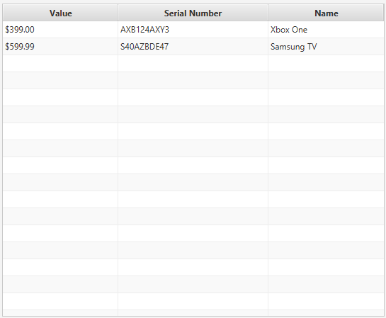
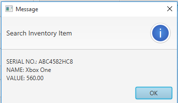
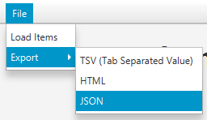

<h2>Inventory Management System</h2>
<h5>Inventory Input</h5>

This is inventory input screen. Use save button to save the values and cancel to clear and cancel current operation

<h5>Inventory Input Error</h5>

If any error occurred during saving inventory item error with description is shown in a dialog like above.

<ht>Inventory Items Table</ht>

Inventory items which are added or loaded from file are show in a table like above. Use can select an item from the 
table and close edit or delete button at the bottom of the table to edit or deleted the selected
item respectively

<h5>Inventory Item Search Result</h5>

On successful search, by name or serial no, the found item is show like above in a dialog

<h5>File Menu</h5>

The load item is used to load inventory data from a file which is previouly exported. 
On clicking this item a file choose is show and user has to nevigate to the file to load. If the
file contains valid data it loads the file and show the content in the table. The export menu has
3 options. User can export to any of the TSV (tab seperated value) file, json or html. On clicking 
one of the option a file chooser is shown and user has to nevigate to the folder to export and give
name of the export file.

